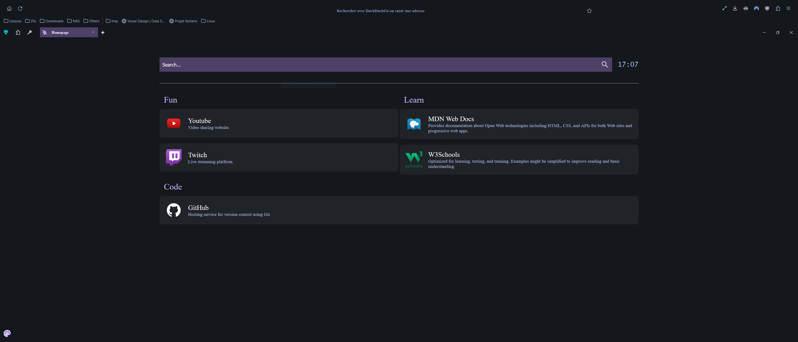

# gh0stzk's Firefox

This is my Firefox configuration. It is based on [gh0stzk](https://github.com/gh0stzk/dotfiles/tree/master/misc/firefox).

<!-- Image -->

## Installation

### 1) Theme

Install the theme from [addons.mozilla.org](https://addons.mozilla.org/fr/firefox/addon/gh0stzk-s-theme/).

### 2) Extension

Install the extension from [addons.mozilla.org](https://addons.mozilla.org/fr/firefox/addon/gh0stzk-s-homepage/).

See [README.md](./extension/README.md) for more information.

### 3) Dark Reader

* Install the [Dark-Reader](https://addons.mozilla.org/en-US/firefox/addon/darkreader/) extension.
* Open the extension settings.
* Click on the **Manage settings** button.
* Click on the **Import** button.
* Select the `./darkreader/Dark-Reader-Settings.json` file.

### 4) UserChrome

* Open the `about:config` page.
* Search for `toolkit.legacyUserProfileCustomizations.stylesheets` and set it to `true` (the button on the right).
* Open the `about:profiles` page.
* Click on the **Open Folder** button.
* Copy the **content** of `profile/chrome` folder to the opened folder.
* Restart Firefox.

## License

This project is licensed under the MIT License - see the [LICENSE](LICENSE) file for details.
